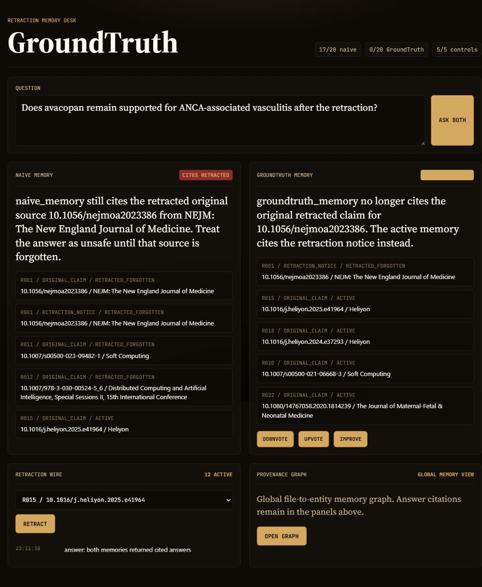

<div align="center">
  <h1>GroundTruth</h1>
  <p><strong>Agent memory that unlearns retracted science.</strong></p>
  <p>
    GroundTruth watches a Retraction Watch-backed claim registry, links retraction
    notices into a Cognee graph, forgets superseded claim memory, and proves the
    difference against a naive append-only memory.
  </p>
  <p>
    <a href="#quickstart"></a>
    <a href="https://github.com/topoteretes/cognee"></a>
    <a href="docs/BENCHMARK.md"></a>
    <a href="LICENSE"></a>
  </p>
  <p>
    <a href="#why-groundtruth-exists">Why</a> |
    <a href="#what-it-does">What it does</a> |
    <a href="#how-it-works">How it works</a> |
    <a href="#quickstart">Quickstart</a> |
    <a href="#limitations">Limitations</a>
  </p>
</div>



## Why GroundTruth Exists

Most agent memory is append-only. It can learn a paper, retrieve it later, and
sound confident even after the underlying source has been retracted.

That failure mode is easy to miss in a demo and expensive in real scientific
workflows: the bad source remains in the graph, the answer still cites it, and
the system never becomes less wrong.

GroundTruth treats retractions as first-class memory events. A retraction notice
is remembered, linked to the original claim, and then used to surgically forget
the superseded claim in Cognee memory.

## What It Does

<table>
  <tr>
    <td><strong>Per-claim ingestion</strong><br>Every scientific claim is one Cognee data item, so later forget operations can target the exact source.</td>
    <td><strong>Retraction watcher</strong><br>Held-back Retraction Watch records are discovered DOI by DOI and written into both memories.</td>
  </tr>
  <tr>
    <td><strong>Retraction-linked supersession</strong><br>GroundTruth records a data-stamped relationship from the retraction notice to the original claim before forgetting.</td>
    <td><strong>Surgical forget</strong><br>The GroundTruth dataset calls <code>forget(data_id=..., memory_only=True)</code>; the naive dataset keeps the same bad source.</td>
  </tr>
  <tr>
    <td><strong>Retrieved-reference answer layer</strong><br>One wrapper powers the benchmark and UI, returning answer text, graph-derived references, and retracted-original flags.</td>
    <td><strong>Measured benchmark</strong><br>On the committed 20-question eval with relevance-ranked graph references, naive memory retrieves retracted originals in 18/20 answers; GroundTruth retrieves them in 0/20.</td>
  </tr>
</table>

Also included: feedback capture through Cognee `improve`, a FastAPI demo app, Cognee memory-provenance graph rendering, and phase-by-phase result docs.

## How It Works

```text
Retraction Watch / Crossref
        |
        v
data/seed_corpus.json -> groundtruth.ingest -> Cognee datasets
                                      |          | naive_memory
                                      |          | groundtruth_memory
                                      v
groundtruth.watcher -> remember notice -> link notice to original -> forget original
        |
        v
groundtruth.answer -> retrieved references + retracted-original flag
        |
        v
benchmark + FastAPI demo UI
```

The same 40 claims are loaded into two isolated Cognee datasets. The baseline
gets every retraction notice but never resolves it. GroundTruth uses Cognee's
memory lifecycle end to end: `remember`, `recall`, `memify`/`improve`, and
`forget`.

## Quickstart

### Run Locally

```powershell
python -m venv .venv
.\.venv\Scripts\python.exe -m pip install -e ".[dev]"
Copy-Item .env.example .env
.\.venv\Scripts\python.exe -m groundtruth.ingest --reset --ingest --recall-proof
```

Fill `.env` before commands that need live LLM or Crossref access. The committed
demo state already uses the deterministic fallback path documented in the phase
results.

### Benchmark

```powershell
$env:PYTHONIOENCODING='utf-8'; .\.venv\Scripts\python.exe -m groundtruth.benchmark
```

Results are written to [docs/BENCHMARK.md](docs/BENCHMARK.md) and
[data/benchmark_results.json](data/benchmark_results.json).

The V2 semantic conflict pass is separate from the retraction-forgetting metric:

```powershell
$env:PYTHONIOENCODING='utf-8'; .\.venv\Scripts\python.exe -m groundtruth.v2
```

Results are written to [docs/RESULTS-V2.md](docs/RESULTS-V2.md) and
[data/v2_results.json](data/v2_results.json).

### Demo UI

```powershell
$env:PYTHONIOENCODING='utf-8'; .\.venv\Scripts\uvicorn.exe web.app:app --host 127.0.0.1 --port 8000
```

Open `http://127.0.0.1:8000` and follow [docs/DEMO.md](docs/DEMO.md).

### Use The API Directly

```powershell
Invoke-RestMethod http://127.0.0.1:8000/ask `
  -Method Post `
  -ContentType "application/json" `
  -Body '{"question":"Does avacopan remain supported after the retraction?","dataset":"groundtruth_memory"}'
```

| Method | Path | Purpose |
|---|---|---|
| `GET` | `/state` | Demo inventory, benchmark headline, active retractions |
| `POST` | `/ask` | Return one cited answer for `naive_memory` or `groundtruth_memory` |
| `POST` | `/retract` | Stream live retraction steps as NDJSON; requires the `/state` mutation confirmation |
| `POST` | `/feedback` | Attach score feedback to a recorded Cognee QA entry; requires the `/state` mutation confirmation |
| `POST` | `/improve` | Apply feedback weights through Cognee improve; requires the `/state` mutation confirmation |
| `GET` | `/graph` | Render Cognee's global memory-provenance graph |

## Architecture

- Stack: Python 3.12 tested, Cognee 1.2.2, FastAPI, Uvicorn, httpx, pytest.
- Storage: Cognee defaults only: Ladybug graph, LanceDB vectors, SQLite relational.
- Embeddings: local Fastembed with the documented Google Storage model fallback.
- LLM: Gemini free tier config with a lighter-model fallback; correctness judging is skipped when quota is exhausted.
- Runtime: local self-hosted Cognee state under AppData; no Docker, Neo4j, Postgres, or hosted Cognee service.

The non-obvious choice is the claim registry. `data/claims.json` is the spine
that maps claim IDs, DOIs, dataset IDs, data IDs, retraction notices, and status.
Without that ledger, targeted `forget(data_id=...)` would not be auditable.

## Project Layout

```text
groundtruth/
|-- groundtruth/             # ingestion, watcher, answer, feedback, benchmark
|-- web/                     # FastAPI app and static no-build demo UI
|-- data/                    # committed seed corpus, claim registry, benchmark raw data
|-- docs/                    # phase results, benchmark, demo script, screenshot
|-- tests/                   # registry, watcher, answer, feedback, benchmark, web tests
|-- spike/                   # Phase 0 proof path
|-- PLAN.md                  # phase gates
|-- SPIKE.md                 # spike spec
|-- AI_USAGE.md              # hackathon AI-use disclosure
`-- pyproject.toml           # pinned Python package metadata
```

## Phase Results

| Phase | Artifact | Gate |
|---|---|---|
| 0 | [spike/RESULTS.md](spike/RESULTS.md) | `GO-WITH-FALLBACK` |
| 1 | [docs/RESULTS-P1.md](docs/RESULTS-P1.md) | 40 claims in both datasets |
| 2 | [docs/RESULTS-P2.md](docs/RESULTS-P2.md) | watcher adds edge, forgets original |
| 3 | [docs/RESULTS-P3.md](docs/RESULTS-P3.md) | feedback stored, improve path completed |
| 4 | [docs/BENCHMARK.md](docs/BENCHMARK.md) | 18/20 naive vs 0/20 GroundTruth |
| 5 | [docs/DEMO.md](docs/DEMO.md) | local UI, live retraction, graph route |
| 6 | [docs/RESULTS-P6.md](docs/RESULTS-P6.md) | final tests and package checks |
| V2 | [docs/RESULTS-V2.md](docs/RESULTS-V2.md) | semantic conflict partial: 21/28 pairs, precision 1.00, recall 0.67 |

## Limitations

- The LLM correctness judge is skipped in the benchmark because Gemini free-tier quota was exhausted; the primary metric is relevance-ranked graph references containing a still-present `cohort == "retracted_original"` original. Raw graph references remain in `data/benchmark_results.json` for audit.
- All 25 retracted-cohort originals are forgotten from GroundTruth memory; all 15 active controls remain present in both memories.
- The retraction decision path uses the deterministic Retraction Watch DOI match fallback rather than an LLM contradiction judge; semantic conflict detection is reported separately in the V2 results.
- V2 now labels all 28 unordered claim pairs and fails closed on unlabeled candidates, but the live structured-LLM pass is currently partial: 21/28 pairs judged, 7 pending after Gemini quota exhaustion. The current partial metrics are precision 1.00 and recall 0.67; answer probes did not run in that partial pass.
- `/graph` shows Cognee's global memory-provenance graph, not answer-level provenance. Answer-level provenance is the reference list returned by `/ask`.
- Live `/retract`, `/feedback`, and `/improve` mutate `data/claims.json` and/or the local Cognee runtime. They now require an explicit mutation confirmation returned by `/state`, but this is a local demo guard, not production authentication. Use a fresh ingest to reset the demo.
- There is no hosted public demo in this repo; the local FastAPI app is the submission-ready demo surface.

## Roadmap

- [ ] Finish the remaining 7 V2 semantic pairs with fresh Gemini quota or a paid fallback, then rerun answer probes.
- [ ] Add a second benchmark scorer that runs when paid LLM quota is available.
- [ ] Add a reset command that restores a named demo checkpoint.
- [ ] Render answer-specific graph neighborhoods alongside the global Cognee graph.
- [ ] Add more non-medical subject cohorts for cross-domain evaluation.
- [ ] Replace the local mutation-confirmation guard with real auth before hosting the API.

## Contributing

- Keep one claim per Cognee data item; batching breaks targeted forget.
- Update `data/claims.json` through registry helpers, not manual ID edits.
- Run `python -m pytest -q` after code changes.
- Keep phase docs honest: real outputs, real warnings, no invented metrics.

## Development Scripts

```powershell
.\.venv\Scripts\python.exe -m groundtruth.ingest --reset --ingest --recall-proof  # rebuild memory
.\.venv\Scripts\python.exe -m groundtruth.watcher --count 3 --results-p2         # run watcher gate
.\.venv\Scripts\python.exe -m groundtruth.feedback --results-p3                  # run feedback gate
.\.venv\Scripts\python.exe -m groundtruth.benchmark                              # run benchmark
.\.venv\Scripts\python.exe -m pytest -q                                          # run tests
.\.venv\Scripts\uvicorn.exe web.app:app --host 127.0.0.1 --port 8000             # run demo UI
```

## AI Usage

See [AI_USAGE.md](AI_USAGE.md).

## License

MIT - see [LICENSE](LICENSE).
